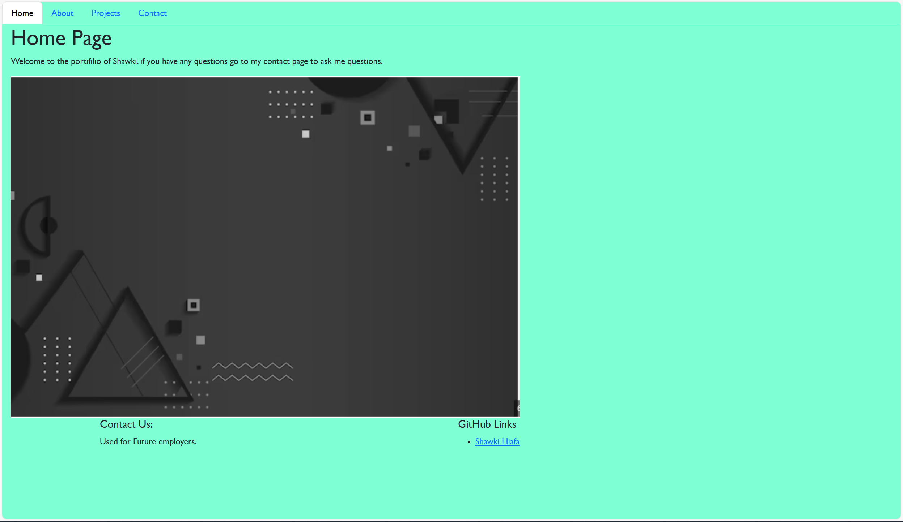

# My-Portfolio

## Description 
    This challenge we are creating a potfllio ussing react along with CSS to design. It is a simple portfolio you just get to the homepage and everything click on to where you want to go.

## Sources
 - Instructors and tutors
 - MDN
 - Youtube
 - W3schools
 - flexbox froggy

 ## Project Links
    - https://shawki45.github.io/My-Portfolio/
    - https://github.com/Shawki45/My-Portfolio.git
    

 ## Screenshot

